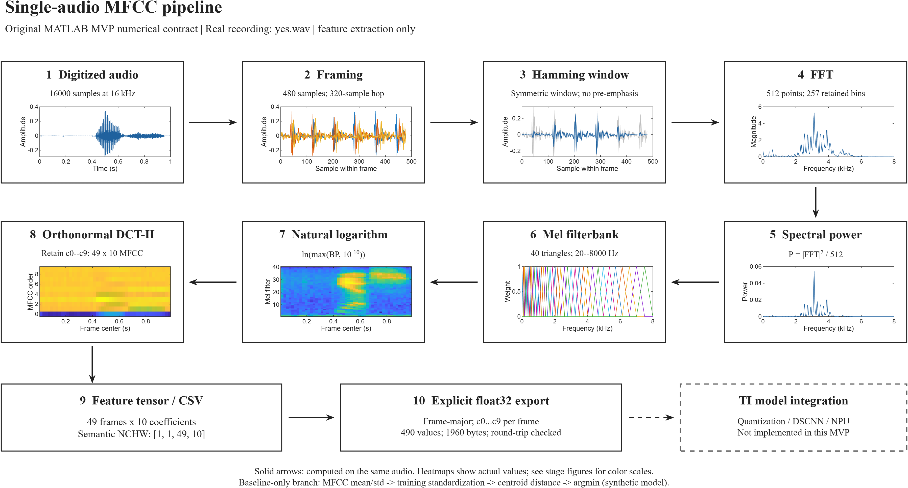
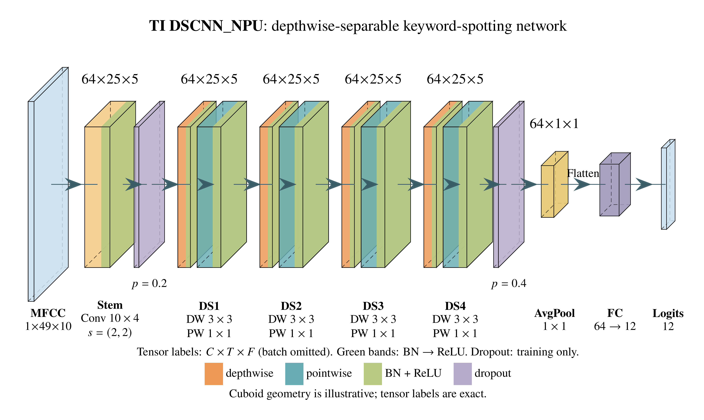

# DSP Front-End and DSCNN Co-Optimization for Keyword Spotting

**Primary work:** digital signal processing before the deep-learning model,
jointly optimized with feature dimensions, quantization and DSCNN architecture.
Start with the [active research focus](RESEARCH_FOCUS.md),
[MATLAB + PlotNeuralNet workbench](research/ti_gsc_matlab_mvp/README.md), and
[online research page](https://wenqiwang1314-dotcom.github.io/elec5305-project-550552222/dsp-model-codesign.html).

| Real-audio DSP pipeline | TI DSCNN architecture |
|---|---|
| [](docs/assets/research/paper_pipeline.pdf) | [](docs/assets/research/dscnn_plotneuralnet.pdf) |
| [Vector PDF](docs/assets/research/paper_pipeline.pdf) · [SVG](docs/assets/research/paper_pipeline.svg) | [Vector PDF](docs/assets/research/dscnn_plotneuralnet.pdf) · [SVG](docs/assets/research/dscnn_plotneuralnet.svg) |

The real `yes` walkthrough displays every DSP module's output. The configurable
PlotNeuralNet source regenerates the model figure after architecture changes.
Detailed English comments, the licensed example audio, frozen legacy reference
and intermediate numeric arrays are retained. These figures establish a
reproducible processing example and sourced architecture, not trained DSCNN or
hardware performance.

```matlab
% From the repository root; tested with MATLAB R2026a.
cd(fullfile('research','ti_gsc_matlab_mvp'))
run_ti_gsc_single_audio
```

See the [workbench instructions](research/ti_gsc_matlab_mvp/README.md) for
numerical validation and rebuilding PlotNeuralNet figures. The equivalent cached
DSP experiment is now complete on PC: 960/960 exact matches and 1.31x speedup
(ratio of median batch-average times). Next are compact constant storage and
independently retrained, matched-budget DSP/model pairs.

## Project context

ELEC5305 project studying how raw-audio conditioning, time-frequency feature
extraction, tensor quantization, and compact model architecture can be jointly
optimized for 12-class audio classification on a TI NPU. The reproducible anchor
is Texas Instruments' Google Speech Commands DSCNN example for MSPM0G5187.

**Student:** Lucas(Wenqi) Wang (SID 550552222)

**Project site:** https://wenqiwang1314-dotcom.github.io/elec5305-project-550552222/

**Project Feedback Two (9 October):** [progress and new measured DSP results](https://wenqiwang1314-dotcom.github.io/elec5305-project-550552222/feedback-two.html).
The progress page links the submission PDF, exact-parity audit, timing rounds,
limitations, and runnable code. Reproduce the new experiment from the repo root:

```matlab
addpath(fullfile('research','ti_gsc_matlab_mvp'))
benchmark_cached_frontend
```

This benchmark uses the bundled 12 ZIPs directly; no private dataset path or
additional toolbox is required. It verifies ZIP/WAV hashes, adapts 84 short
clips with explicit zero-padding, compares all 960 MFCC maps, tests edge inputs,
and alternates cached/uncached timing order over nine warmed-up rounds.

**Final proposal PDF:** [ELEC5305 Project Proposal](output/pdf/ELEC5305_Project_Proposal_Lucas_Wenqi_Wang_550552222.pdf)

## Earlier diagnostics and project status

- Real dataset found and audited: 105,829 16 kHz WAV files (spoken-word clips
  are up to approximately one second; background recordings are longer).
- Official validation/test lists are respected.
- MATLAB smoke test: hand-written MFCC plus 5-nearest-neighbour baseline.
- Preliminary result: 39.17% accuracy/macro recall on 240 held-out samples,
  with zero audited speaker overlap (12-class chance level: 8.33%).
- Controlled MFCC ablation: TI plus utterance CMN reached 47.08% clean accuracy
  at the same 490-element input; all clean-trained variants remained near
  chance at 10 dB, motivating noise-aware training.
- Eight source-supplied/open research PDFs are archived with page-count and
  SHA-256 verification; ScienceDirect and IEEE publisher records are indexed.
- Twelve downloadable class archives contain the fixed 960-waveform development
  subset with provenance, split, format, derivation status, and SHA-256 records.
- DSCNN training, compression, and MCU deployment remain future work.

## Run the earlier dataset diagnostics

```matlab
cd('F:\CodeX_Workspace\elec5305-keyword-spotting\src')
run_dataset_smoke_test
run_mfcc_ablation
export_github_audio_subset
```

The script writes its exact sample manifest, split audit, metrics, figures, and
machine-readable PASS/FAIL markers into `results/`.

The detailed analysis is in [MFCC_OPTIMIZATION_ANALYSIS.md](MFCC_OPTIMIZATION_ANALYSIS.md),
the supplied course references are mapped to testable design decisions in
[COURSE_REFERENCE_NOTES.md](COURSE_REFERENCE_NOTES.md),
the full research protocol is in
[PREPROCESSING_NPU_RESEARCH_PLAN.md](PREPROCESSING_NPU_RESEARCH_PLAN.md),
and the corresponding project page is
https://wenqiwang1314-dotcom.github.io/elec5305-project-550552222/mfcc-optimization.html.

Download the twelve class archives from the
[dataset page](https://wenqiwang1314-dotcom.github.io/elec5305-project-550552222/dataset.html).

## Evidence boundary

The smoke test and MFCC ablation are small classical diagnostics used to isolate
data loading, partitioning, and preprocessing. Their accuracy and desktop timing
must not be reported as DSCNN, quantized NPU, or embedded-device results.

## Project site

The proposal site is in `docs/` and is ready to be served with GitHub Pages.
